CVGenie - Advanced native Android CV generator app

<b>Overview</b>

Writing an effective CV does not have to be hard. A precision targeted and professionally typeset CV is the key to scoring an interview. Simply fill in your information, and CVGenie produces a clean, correctly formatted PDF CV you can email it, post it online, or print it out. You can store your generated CVs remotely in a server within your account so only you can find them anywhere.
 

<b>Features</b>
<ul>
<li>Kotlin Language: This project is developed in Kotlin language with Google latest guideline and material design.</li>
<li>Fill in your information and generate your CV.</li> 
<li>Register, sign in and retrieve password functionalities.</li> 
<li>Store generated CVs remotely.</li>
<li>Light/Dark themes</li>  
<li>Supports Android 13.</li>

</ul>

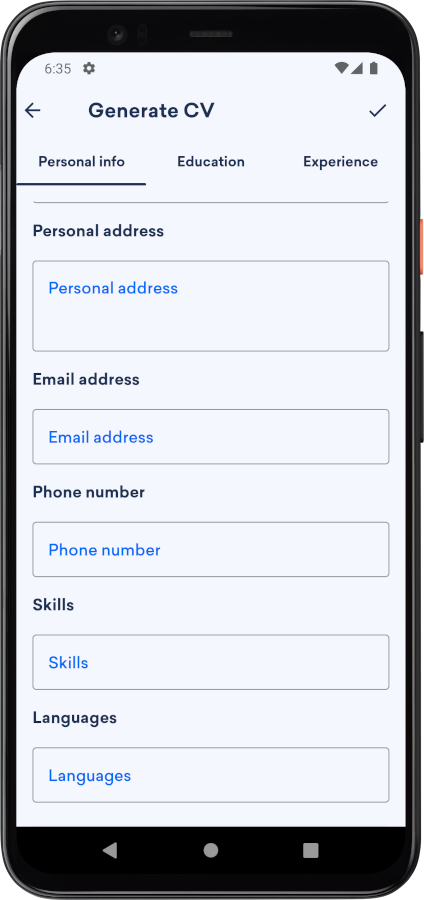
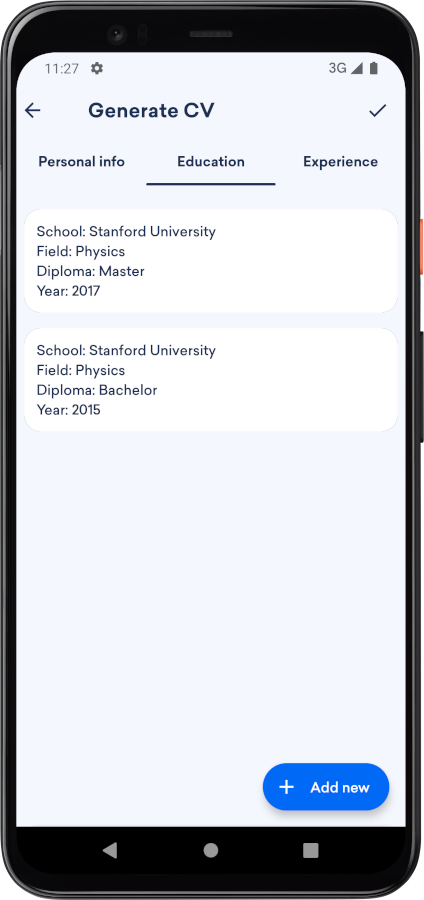
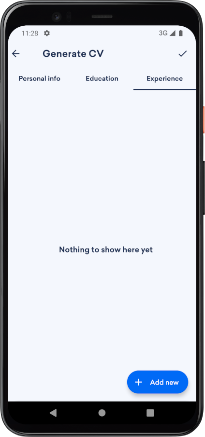
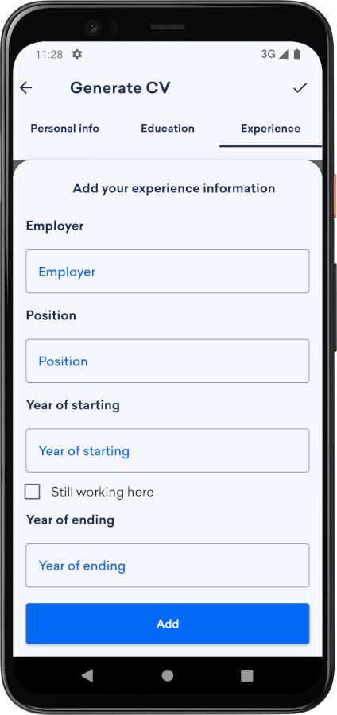
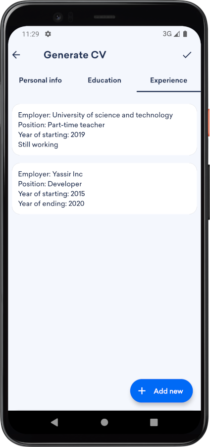
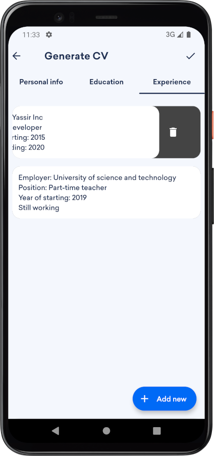
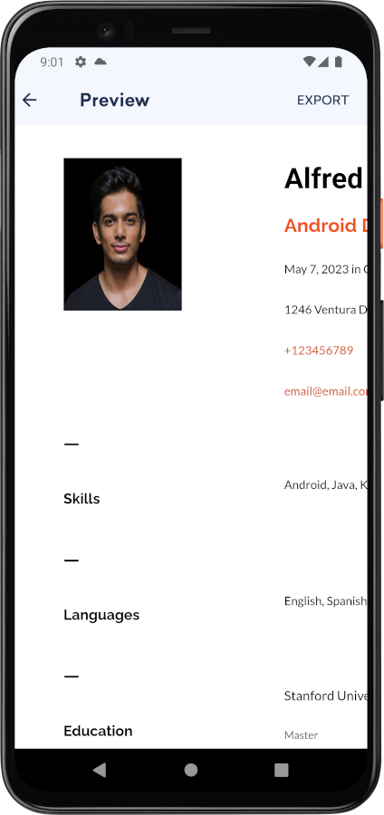

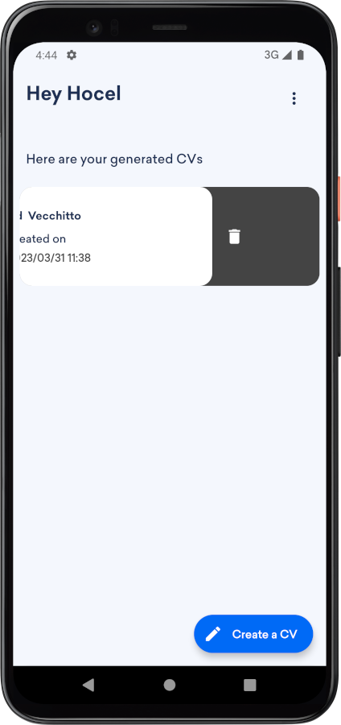
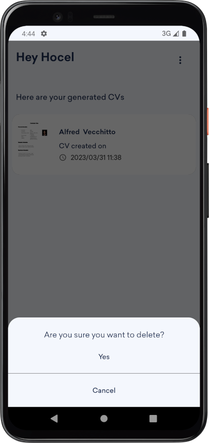
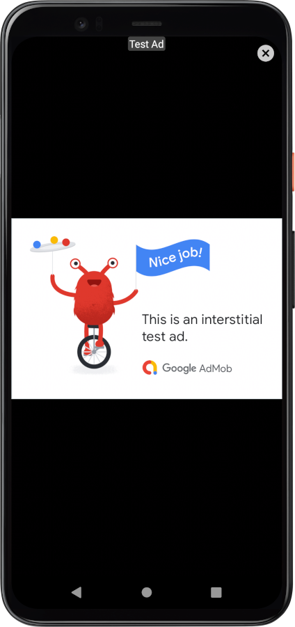
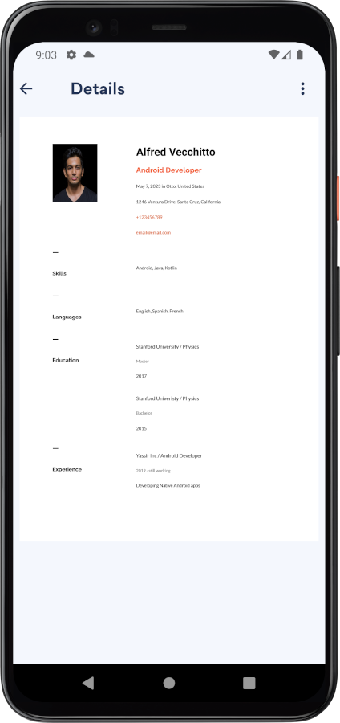
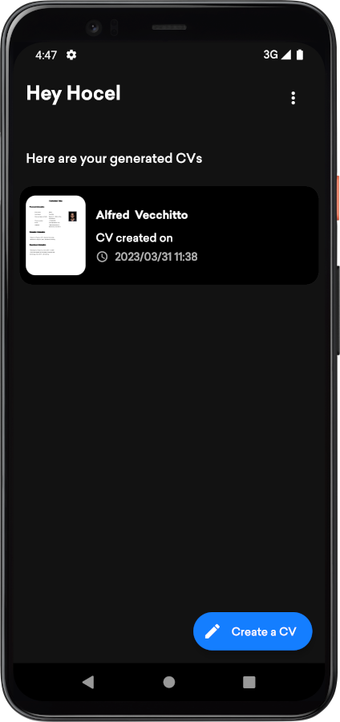
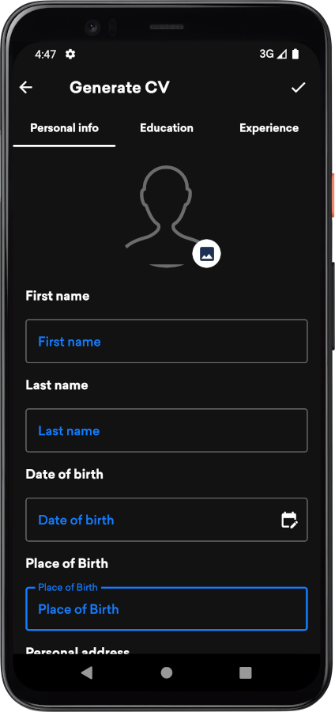
